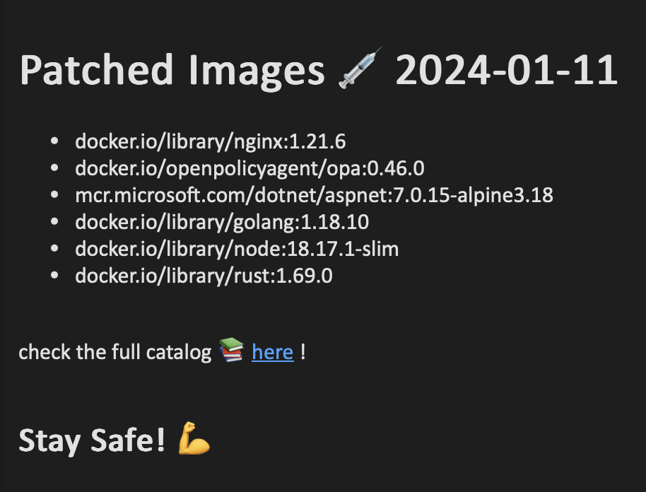
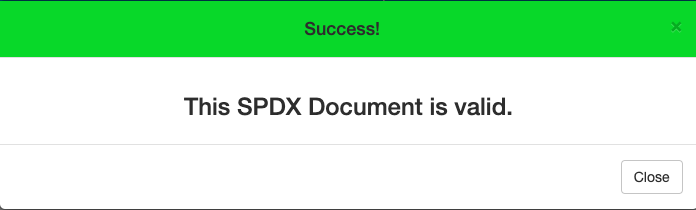
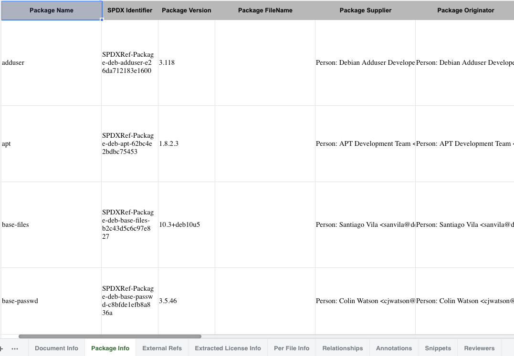

# IMMUNIZE

[](https://github.com/R3DRUN3/immunize/actions/workflows/patch.yaml)  


Pipeline for patching vulnerable container images 💉📦

## Abstract
The present is a repository containing a [Github action](https://github.com/features/actions) to patch  
vulnerable container images with [copacetic](https://github.com/project-copacetic/copacetic) and attest them with [cosign](https://docs.sigstore.dev/signing/quickstart/).  

> [!Note]
> The patched images can be found [here](https://github.com/R3DRUN3?tab=packages&repo_name=immunize).  

## Instructions

The pipeline is triggered upon a push to the repo (any branch).   
The corresponding action is configured in the `.github/workflows/patch.yaml` file.  
Specifically, the list of container images to patch is specified within the strategy as follows:

```yaml
images: ['docker.io/library/nginx:1.21.6', 'docker.io/openpolicyagent/opa:0.46.0']
```  
Following is an high-level description of the pipeline jobs and steps:  
## Immunize Job
### Overview:

This job is triggered on every push event (excluding changes to README.md) and focuses on scanning and immunizing Docker images for security vulnerabilities.
### Steps: 
1. **Install Cosign:**  
   - Install *Cosign* on the runner environment  
1. **Set up Docker Buildx:**  
   - Uses the `docker/setup-buildx-action` to set up Docker Buildx for multi-platform builds. 
1. **Generate Trivy Report:**  
   - Utilizes the `aquasecurity/trivy-action` to scan specified Docker images for OS vulnerabilities and generates a JSON report. 
1. **Check Vuln Count:**  
   - Parses the Trivy report using `jq` to count the number of vulnerabilities and outputs the count to the GitHub environment. 
1. **Set Tag:** 
   - Extracts the tag from the Docker image reference and appends "-immunized" to create a new tag. Sets this new tag in the GitHub environment. 
1. **Copa Action:**  
   - Conditionally executes the `project-copacetic/copa-action` if vulnerabilities are found.
   - Utilizes Copa to apply security patches to the Docker image, generating a patched image and a detailed report.  
1. **Log into ghcr:**  
   - Logs into GitHub Container Registry (ghcr.io) using the `docker/login-action` with the GitHub token. 
1. **Tag Image for GHCR:** 
   - Tags the patched Docker image and prepares it for pushing to GitHub Container Registry.  
1. **Docker Push Patched Image:**
   - Pushes the patched Docker image to GitHub Container Registry for storage and distribution.  
1. **Produce Image SBOM:**
   - Produce a *Software Bill of Material* using the `anchore/sbom-action` for the pushed image.  
1. **Sign image with Cosign:**  
   - Sign the pushed image with *Cosign*  
1. **Attest the Image with SBOM**:
   - Attest the image using the SBOM as a predicate via cosign.


## Send-Mail-Report Job
### Overview:

This job is dependent on the completion of the `Immunize` job and is responsible for sending an email report.  
If you dont need this job you can comment it out in the pipeline manifest.  
### Steps: 
1. **Checkout Repository:** 
   - Checks out the repository to access necessary files and scripts. 
2. **Send Mail Report:**  
   - Executes a Python script (`send_mail_report.py`) located in the repository, sending a report via email.  
   - Configures email recipient addresses, sender address, and password using github action secrets.  
3. **Report Example**:  
   - 

<br />


To perform image pulls, authentication is not required; however, GitHub may prompt for a token if the API call limit is exceeded.  
In such instances, please refer to the instructions provided [here](https://docs.github.com/en/packages/working-with-a-github-packages-registry/working-with-the-container-registry#authenticating-with-a-personal-access-token-classic) to configure an access token.  
Subsequently, proceed to log in as follows:

```console
export CR_PAT=YOUR_TOKEN \
&& echo $CR_PAT | docker login ghcr.io -u USERNAME --password-stdin

Login Succeeded
```   

## Verify Patching

>[!Warning]
> Please be aware that *Copacetic* focuses on rectifying vulnerabilities within the operating system's libraries in the corresponding image layer, rather than addressing application dependencies.  

To assess the effectiveness of patching, you may conduct a scan using [Trivy](https://github.com/aquasecurity/trivy) initially on one of the original images:  
```console
trivy image docker.io/openpolicyagent/opa:0.46.0
```  

Output for OS CVEs:  
```console   
Total: 41 (UNKNOWN: 0, LOW: 11, MEDIUM: 21, HIGH: 9, CRITICAL: 0)
```  

And then on the immunized version of that same image:  
```console
trivy image ghcr.io/r3drun3/immunize/docker.io/openpolicyagent/opa:0.46.0-immunized
```  

Output for OS CVEs:  
```console   
Total: 18 (UNKNOWN: 0, LOW: 11, MEDIUM: 7, HIGH: 0, CRITICAL: 0)
```  

As you can see the latest has way less CVEs than the former!  

The benefit becomes even more apparent when patching old images.  
For instance, observe the difference between this:  
```console
trivy image python:3.5.10-slim

Total: 307 (UNKNOWN: 8, LOW: 101, MEDIUM: 81, HIGH: 87, CRITICAL: 30)
```   

and the immunized one:  
```console  
trivy image ghcr.io/r3drun3/immunize/docker.io/library/python:3.5.10-slim-immunized

Total: 148 (UNKNOWN: 0, LOW: 97, MEDIUM: 26, HIGH: 23, CRITICAL: 2)
```  

Critical vulnerabilities have been reduced by ~93%!  

> [!Warning]
> Even though the benefits are more apparent in older images, it is always advisable to prioritize new images and the most recent tags whenever possible.  


## Verify Image Signatures and Attestations
All the patched OCI images produced by the pipeline are signed with [cosign](https://github.com/sigstore/cosign).  
In order to verify the signature, adapt the following command for the desired image:  
```console
cosign verify --key cosign/cosign.pub ghcr.io/r3drun3/immunize/docker.io/library/node:18.17.1-slim-immunized
```   

Output:  
```json

Verification for ghcr.io/r3drun3/immunize/docker.io/library/node:18.17.1-slim-immunized --
The following checks were performed on each of these signatures:
  - The cosign claims were validated
  - Existence of the claims in the transparency log was verified offline
  - The signatures were verified against the specified public key

[
   {"critical":
      {"identity":{"docker-reference":"ghcr.io/r3drun3/immunize/docker.io/library/node"},
      "image":
      {"docker-manifest-digest":"sha256:19940c59087a363148b44c56447186d97d6afbc2165727b2d0a2ea0ce43b69fd"},
      "type":"cosign container image signature"},
      "optional":
         {"Bundle":
         {"SignedEntryTimestamp":"MEUCIHo1Jja4t0+OPDYqHo/B/p7HUtP+/i8ZD+fu6Rb57Lw9AiEA7N1i7JDiIvRxu9QtYOrrS8Y+AeekHMWNE3p7GJAbHAs=",
         "Payload":     {"body":"eyJhcGlWZXJzaW9uIjoiMC4wLjEiLCJraW5kIjoiaGFzaGVkcmVrb3JkIiwic3BlYyI6eyJkYXRhIjp7Imhhc2giOnsiYWxnb3JpdGhtIjoic2hhMjU2IiwidmFsdWUiOiI2MmM1NWZhNGQxMjE5YTk5ZWJhMjkzY2E0YzNiNmFiN2Y1Y2QxNmE5YjFmMmY2OWVhNDlmM2NkZDhkYzg4ODcwIn19LCJzaWduYXR1cmUiOnsiY29udGVudCI6Ik1FWUNJUUMxenUwajdZejVLUWpwYU5sTnkvRkpUT3FQZ0k4RHcrbVR6Z2s4R2JjV1lnSWhBTlBaTzQ3TFNvcW82MGJYWXd4aWo1SkFDVmxpZjZpdmpTNlVaRlJMMHdpMyIsInB1YmxpY0tleSI6eyJjb250ZW50IjoiTFMwdExTMUNSVWRKVGlCUVZVSk1TVU1nUzBWWkxTMHRMUzBLVFVacmQwVjNXVWhMYjFwSmVtb3dRMEZSV1VsTGIxcEplbW93UkVGUlkwUlJaMEZGTWxwdllrWlVTWFI1VDFodllqbHdTM053VWpCaFJGTmhXR3BXYWdwRVJYQTRZbkpFYzJ0Q05rOXVUVlY0TjBkUlJXSnNSREpTUkVKQ2JWQTFWRUZMZG5Od1lYa3ljM2x3TkZvck5YTXlWalk1ZGxNNFQwdG5QVDBLTFMwdExTMUZUa1FnVUZWQ1RFbERJRXRGV1MwdExTMHRDZz09In19fX0=",
   "integratedTime":1705317423,
   "logIndex":63825695,
   "logID":"c0d23d6ad406973f9559f3ba2d1ca01f84147d8ffc5b8445c224f98b9591801d"}
     }
    }
   }
]
```   

The pipeline, for every image, produces an SBOM in [SPDX](https://spdx.github.io/spdx-spec/v2.3/) format and creates an [in-toto attestation](https://docs.sigstore.dev/verifying/attestation/) for the image using that artifact as a predicate.  

> [!Note]
> You can learn the difference between SBOMs and Attestations [here](https://edu.chainguard.dev/open-source/sbom/sboms-and-attestations).


In order to verify the image attestation with cosign, use the following command (adapt for the desired image):  
```console
export IMAGE=ghcr.io/r3drun3/immunize/docker.io/openpolicyagent/opa:0.46.0-immunized
cosign verify-attestation --type spdx --key ./cosign/cosign.pub $IMAGE
```   

The above command verifies and returns the uploaded artifact data in *base64* format.  
We can decode it to query the artifact (in this case, the SBOM file):  
```console
cosign verify-attestation --type spdx --key ./cosign/cosign.pub $IMAGE | jq -r .payload | base64 -D | jq .
```   
The SPDX sbom is the `predicate` property in the previous command output:  


Output Sample:  
```json
Verification for ghcr.io/r3drun3/immunize/docker.io/openpolicyagent/opa:0.46.0-immunized --
The following checks were performed on each of these signatures:
  - The cosign claims were validated
  - Existence of the claims in the transparency log was verified offline
  - The signatures were verified against the specified public key
{
  "_type": "https://in-toto.io/Statement/v0.1",
  "predicateType": "https://spdx.dev/Document",
  "subject": [
    {
      "name": "ghcr.io/r3drun3/immunize/docker.io/openpolicyagent/opa",
      "digest": {
        "sha256": "45de0d4de2ef8590ccdb97ee817d70ba6bb3efb70aabd4abe74a3a6facff24ea"
      }
    }
  ],
  "predicate": "[SPDX-SBOM-HERE]"
}
```   


In order to better understand the previous output, take a look at the [in-toto attestation framework spec](https://github.com/in-toto/attestation/blob/main/spec/README.md#in-toto-attestation-framework-spec).  
In ordert to understand how in-toto verifies an attestation, take a look at the [in-toto validation model](https://github.com/in-toto/attestation/blob/main/docs/validation.md).  
If you want to learn how to enforce the SBOM attestations on your kubernetes cluster take a look at [this repo](https://github.com/R3DRUN3/cyberhall/tree/main/k8s-security/k8s-sigstore).  

If you want to produce a single json file for the sbom in SPDX format, you can use the following command:  
```console
cosign verify-attestation --type spdx --key ./cosign/cosign.pub $IMAGE | jq -r .payload | base64 -D | jq -r '.predicate | fromjson' > final-spdx.json
```   


Starting from that command you can then use [open source tools](https://spdx.dev/use/tools/open-source-tools/) or [this website](https://tools.spdx.org/app/) to do validation and other operations on the SBOM.  

For example, let's say I want to validate the SBOM for the `ghcr.io/r3drun3/immunize/docker.io/library/python:3.5.10-slim-immunized` image.  
I will start by obtaining the SBOM in Json format:  

```console
export IMAGE=ghcr.io/r3drun3/immunize/docker.io/library/python:3.5.10-slim-immunized
cosign verify-attestation --type spdx --key ./cosign/cosign.pub $IMAGE | jq -r .payload | base64 -D | jq -r '.predicate | fromjson' > final-spdx.json
```   

Then I will head to the aforementioned website, select *validate* and upload my json file:  
  


If I want to produce an XLSX spreadsheet, I will select *convert* on the website, enter the format, upload the file and then download the produced spreadsheet:  
  


